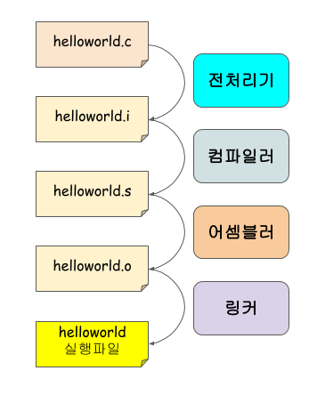

# 실행의 정의

1. 실행이란?
    - CPU가 알아 들을 수 있는 명령을 하는 것
    - 사용자 명령 test.exe -> 실행 이미지 로드 -> (COPY) -> 인스턴스(Process) 생성 RAM -> 기계어 코드 실행
    - 기계어를 가지고 있는 실행 파일을 하드디스크로부터 주기억장치로 복사한 후에 인스턴스로 만들고 관리할 수 있도록 체계를 부여한 후에 CPU가 하나씩 실행하는 것

1. CPU의 역할은 무엇인가?
    - 연산!!!

2. 기계어란 무엇인가?
   - CPU 제조사 : intel, amd, arm
   - intel, amd 프로세서는 x86 호환 프로세서다.
   - CPU가 일을 하기 위해서 명령을 내려야 하는데, 이 명령어가 기계어다.
   
4. 32bit platform 이란 무엇인가?
    - 메인 메모리가 32bit의 주소체계로 이루어진 플랫폼

5. 운영체제에 대해 알고 있는 것은 무엇인가?

1. 프로그래밍 언어로 컴파일을 하면 기계어를 가지고 있는 실행파일을 만들 수 있다.

# CPU의 연산

1. CPU내부의 소량의 기억장치가 있고(레지스터) 그 것이 RAM의 정보를 읽어와서 연산을 하고 특정한 메모리에 저장한다.
    - \*0x0012FF7C = \*0x0012FF70 + \*0x0012FF74 : 0x0012FF70의 정보를 읽어와서 특정 레지스터에 저장하고, 0x0012FF74의 정보도 읽어와서 특정 레지스터에 저장해서 덧셈 연산(CPU)을 한 후에 0x0012FF7C에 대입하라.

2. 결국 이건 메모리를 사용하는것이다. 연산은 CPU가 함!!!!

# 컴파일 과정 정리

## 컴파일이란?

사람이 이해할 수 있는 언어로 된 프로그램 코드를 컴퓨터가 이해할 수 있는 언어로 변환 하는 작업.

여러 소스 파일을 컴파일해서 각 부품을 만들고 그 부품을 조립하여 하나의 실행 파일로 만든다.  
- 여러 소스파일 (helloworld.h helloworld.c, test.c)
- 부품 (helloworld.obj, test.obj)
- 실행파일 (helloworld.exe)

컴파일 -> 링크 -> 실행파일

## GCC 컴파일 과정

helloworld.c -> helloworld.i -> helloworld.s -> helloworld.o -> helloworld
전처리 -> 컴파일 -> 어셈블링 -> 링킹

1. 전처리 과정
    - 전처리 과정은 크게 두 부분으로 나뉘어짐
        - 헤더파일 삽입
        - 매크로 치환 및 적용
    
    - #define 부분을 심볼테이블에 저장 됨
    - 실볼 테이블에 들어있는 문자열과 같은 문자열을 만나면 #define 된 내용으로 치환합니다. 

2. 컴파일 과정
    - 
    - 전처리 과정이 끝나면 컴파일 과정이 시작된다. 
    - 크게 전단부, 중단부, 후단부로 나뉘어진다.
    - 전처리가 끝난 .i 파일을 컴파일하면 .s 어셈블리 코드로 이루어진 파일이 만들어진다.

    - 전단부
        - 
        - 전단부에서는 언어 종속적인 부분을 처리한다.
        - 이 단계에서는 C로 작성된코드나 다른 언어로 작성된 코드들이 각각 다른 모듈에 의해 처리 된다.
        - 또한 소스코드가 올바르게 작성되었는지 분석하고, 중단부에 넘겨주기 위한 GIMPLE 트리를 생성하는 일을 수행한다.

    - 중단부
        - 
        - 중단부에서는 전단부에서 넘겨받은 GIMPLE 트리를 SSA(Static Single Assignment)형태로 변환한 후에 아키텍쳐 비종속적인 최적화를 수행한 후 최종적으로 후단부에서 사용하는 RTL(Register Transfer Language: 고급 언어와 어셈블리 언어의 중간 형태)을 생성합니다.
        - 아키텍쳐 비종속적인 최적화란 서로 다른 CPU 아키텍쳐에 구애받지 않고 공통적으로 수행할 수 있는 최적화를 말합니다. 중단부에서는 SSA 기반으로 최적화를 수행합니다.

    - 후단부
        - 
        - 후단부에서는 RTL Optimizer에 의해 아키텍쳐 비종속적인 최적화와 함께 아키텍쳐 종속적인 최적화가 수행합니다. 
        - 이렇게 최적화를 마치게 되면 Code Generator 어셈블리어로 구성된 .s 파일이 만들어지게 됩니다.

3. 어셈블 과정
    - 어셈블러에 의해 생성되는 목적코드(helloworld.o) 파일은 어셈블된 프로그램의 명령어(Instruction)과 데이터(Data)가 들어있는 ELF 바이너리 포맷(Binary format) 구조를 갖습니다. 

4. 링킹 과정 
    - 어셈블리에 의해 ELF 포맷의 목적코드 파일들이 만들어지면 이제 링커가 나설 차례입니다. 링커는 오브젝트 파일들과 여러분의 프로그램에서 사용된 표준 C 라이브러리, 사용자 라이브러리들을 링크(Link)를 합니다. 
    - printf() 함수나 scanf() 등의 표준 C 라이브러리 함수들은 여러분이 직접 구현하지 않아도 미리 컴파일이 되어 있기 때문에 링크하는 과정만 거치면 사용할 수 있습니다. (표준 C 라이브러리는 별도로 명시하지 않아도 자동으로 링크됩니다)

    - 이렇게 링킹 과정이 끝나면 드디어 실행 가능한 실행파일이 만들어지게 됩니다.
