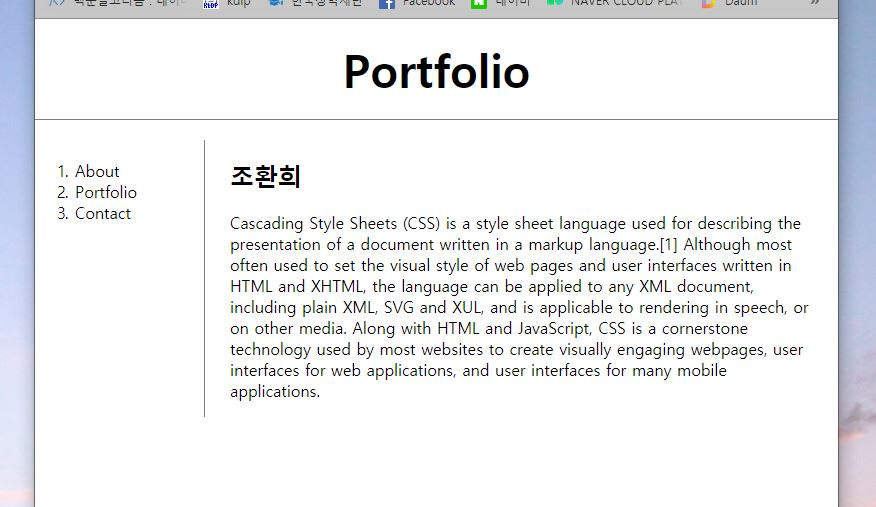
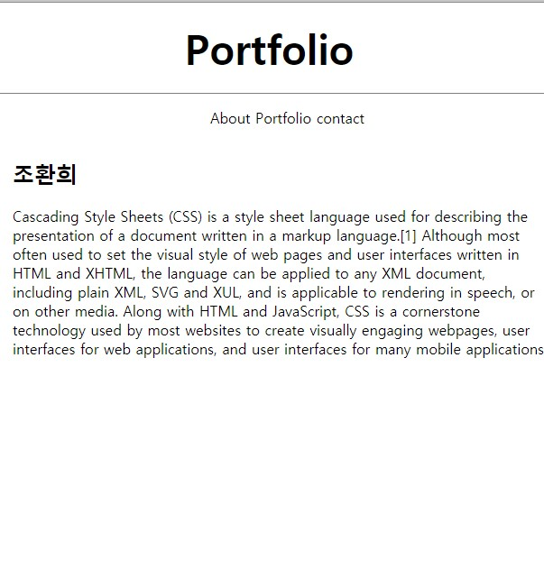

# 미디어 쿼리
미디어 쿼리 기능을 이용해서 반응형 웹 디자인을 할 수 있다.

#### 문법 은 다음과 같다.

```html
@media (max-width:800px) {
	selectors
}

@media (min-width:800px) {
	selectors
}
```
근데, 작업을 하다보니 CSS코드 양이 약 2배 가량 늘어나는데.. 어떤 해결 방법이 있을 지 확인 필요하다.
다음은 작업중인 포트폴리오 페이지를 미디어쿼리 입힌 모습이다.

#### 가로버전


#### 세로버전


#### 소스
```html
<!doctype html>
<html>

<head>
  <title>WEB - CSS</title>
  <meta charset="utf-8">
  <style>
    body {
      margin: 0;
    }

    a {
      color: black;
      text-decoration: none;
    }

    h1 {
      font-size: 45px;
      text-align: center;
      border-bottom: 1px solid gray;
      margin: 0;
      padding: 20px;
    }

    #grid #article {
      padding-left: 25px;
    }

    /*세로모드*/
    @media (max-width:800px) {
      #grid {
        display: grid;
        grid-template-rows: auto;
      }
      #grid #nav {
        text-align: center;
      }
      #grid #nav ol li {
        display: inline;
      }
    }

    /*가로모드*/
    @media (min-width:800px) {
      #grid {
        display: grid;
        border: solid;
        padding:20px;
        grid-template-columns: 150px 1fr;
      }

      #grid #nav {
        border-right: 1px solid gray;
      }

      #grid #nav ol {
        padding-left: 33px;
        width: 100px;
        margin: 0;
        padding: 20px;
      }
    }
  </style>
</head>

<body>
  <h1><a href="index.html">Portfolio</a></h1>
  <div id="grid">
    <div id="nav">
      <ol>
        <li><a href="1.html">About</a></li>
        <li><a href="2.html">Portfolio</a></li>
        <li><a href="3.html">Contact</a></li>
      </ol>
    </div>
    <div id="article">
      <h2>조환희</h2>
      <p>
        Cascading Style Sheets (CSS) is a style sheet language used for describing the presentation of a document written in a markup language.[1] Although most often used to set the visual style of web pages and user interfaces written in HTML and
        XHTML, the language can be applied to any XML document, including plain XML, SVG and XUL, and is applicable to rendering in speech, or on other media. Along with HTML and JavaScript, CSS is a cornerstone technology used by most websites to
        create visually engaging webpages, user interfaces for web applications, and user interfaces for many mobile applications.
      </p>
    </div>
  </div>
</body>

</html>
```
