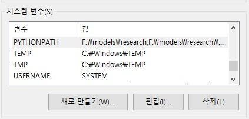
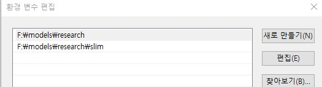
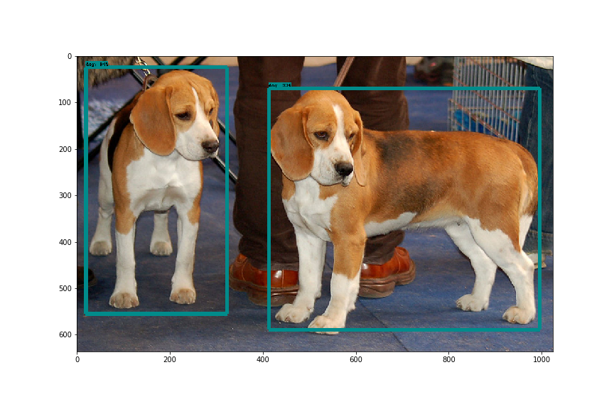

# ML 입문, Tensorflow Object Detection API 호출하는 코드 만들기
잘게 조각나 있는 정보들을 한 자리에 정리해보는 포스팅

Todo  
✔ Tensorflow Object Detection API 호출하는 코드 만들기  
자신만의 데이터셋(소규모)으로 재학습 시켜보기  
tf.estimator 사용해서 성능 측정 해보기  

## 용어 정리
__1. 텐서플로우__ : 텐서플로우는 수치 계산과 대규모 머신러닝을 위한 오픈소스 라이브러리다.  
__2. 머신러닝__ : 기계 학습 또는 머신 러닝(영어: machine learning)은 인공 지능의 한 분야로, 컴퓨터가 학습할 수 있도록 하는 알고리즘과 기술을 개발하는 분야를 말한다. 가령, 기계 학습을 통해서 수신한 이메일이 스팸인지 아닌지를 구분할 수 있도록 훈련할 수 있다. 기계 학습의 핵심은 표현(representation)과 일반화(generalization)에 있다. 표현이란 데이터의 평가이며, 일반화란 아직 알 수 없는 데이터에 대한 처리이다. 이는 전산 학습 이론 분야이기도 하다. 다양한 기계 학습의 응용이 존재한다. 문자 인식은 이를 이용한 가장 잘 알려진 사례이다.  
__3. 딥러닝__ : 기계학습 알고리즘의 집합, 큰 틀에서 사람의 사고방식을 컴퓨터에 가르치는 기계학습의 한 분야  
__4. 인공신경망__ : 기계학습과 인지과학에서 생물학의 신경망(동물의 중추신경계중 특히 뇌)에서 영감을 얻은 통계학적 학습 알고리즘이다. 인공신경망은 시냅스의 결합으로 네트워크를 형성한 인공 뉴런(노드)이 학습을 통해 시냅스의 결합 세기를 변화시켜, 문제 해결 능력을 가지는 모델 전반을 가리킨다. 좁은 의미에서는 오차역전파법을 이용한 다층 퍼셉트론을 가리키는 경우도 있지만, 이것은 잘못된 용법으로, 인공신경망은 이에 국한되지 않는다.  
__5. SSD__ : Pre-trained 모델, Single Shot MultiBox Detector  
__6. Jupyter Notebook__ : 웹 브라우저에서 파이썬 코드를 작성하고 실행까지 해볼 수 있다고 함  
__7. 아나콘다__ : 파이썬 배포판 중 하나. 데이터 분석에 용이함. [https://wikidocs.net/2825](https://wikidocs.net/2825) 여기서 32bit를 받으라고하는데, 왜??? 32비트용 애드온이 더 많은가?  
__8. COCO API__ : COCO is a large image dataset designed for object detection, segmentation, person keypoints detection, stuff segmentation, and caption generation  

## Tensorflow란?
머신러닝은 복잡한 분야다. 그러나 구글 텐서플로우(TensorFlow)와 같은 머신러닝 프레임워크 덕분에 머신러닝 모델을 구현하는 과정은 예전만큼 복잡하거나 어렵지는 않다. 머신러닝 프레임워크는 데이터 획득, 모델 학습, 예측, 미래 결과 정제와 같은 과정을 쉽게 해준다.

- 텐서플로우는 수치 계산과 대규모 머신러닝을 위한 오픈소스 라이브러리다. 
- 크게 머신러닝과 딥 러닝에 쓰인다. 
- 그러나 실제 계산 작업은 파이썬으로 수행되지 않는다. 텐서플로우를 통해 제공되는 변환 라이브러리는 고성능 C++ 바이너리로 작성된다. 파이썬은 각 조각 사이의 트래픽에 길을 안내하고 이를 연결하기 위한 고차원적 프로그래밍 추상화를 제공할 뿐이다.
- 텐서플로우는 필기 숫자 판별, 이미지 인식, 단어 임베딩, 반복 신경망, 기계 번역을 위한 시퀀스 투 시퀀스 모델, 자연어 처리, PDE(편미분방정식) 기반 시뮬레이션 등을 위한 신경망을 학습, 실행할 수 있다. 무엇보다 좋은 점은 학습에 사용되는 것과 동일한 모델로 대규모 프로덕션 예측을 지원한다는 것이다.

## 텐서플로우와 경쟁 프레임워크 비교 
텐서플로우는 여러 머신러닝 프레임워크와 경쟁한다. 파이토치(PyTorch), CNTK, MXNet은 텐서플로우와 상당 부분 용도가 비슷한 주요 경쟁 프레임워크다. 필자가 생각한 텐서플로우와 비교한 각 프레임워크의 장단점은 다음과 같다.

- 파이토치(PyTorch): 파이썬으로 구축된다는 점 외에도 텐서플로우와 유사한 부분이 많다. 하드웨어 가속 구성 요소, 진행하면서 설계가 가능한 고도의 대화형 개발 모델, 그 외의 많은 유용한 구성 요소가 기본적으로 포함된다. 파이토치는 일반적으로 단시간 내에 실행해야 하는 빠른 프로젝트 개발에 더 유리하지만 큰 프로젝트와 복잡한 워크플로에서는 텐서플로우가 더 적합하다.

- CNTK: 마이크로소프트 코그니티브 툴킷(Cognitive Toolkit)은 텐서플로우와 마찬가지로 그래프 구조를 사용해 데이터 흐름을 기술하지만 딥 러닝 신경망을 만드는 데 초점을 둔다. CNTK는 여러 가지 신경망 작업을 더 빠르게 처리하며 폭넓은 API를 보유하고 있다(파이썬, C++, C#, 자바). 그러나 현재 CNTK는 텐서플로우만큼 배우고 배포하기가 쉽지는 않다.

- 아파치(Apache) MXNet: 아마존이 AWS의 고급 딥 러닝 프레임워크로 채택했으며 복수의 GPU와 머신에 걸쳐 거의 선형적으로 확장이 가능하다. 또한 파이썬, C++, 스칼라, R, 자바스크립트, 줄리아, 펄, 고 등 폭넓은 언어 API를 지원한다. 다만 네이티브 API의 사용편의성은 텐서플로우에 비해 떨어진다. editor@itworld.co.kr  

## Objection Detection 실행을 위한 환경세팅

1. tensorflow 설치

pip install tensorflow-gpu  
pip install tensorflow

Linux용
```
$ sudo apt-get install protobuf-compiler python-pil python-lxml python-tk
(venv) $ pip install jupyter
(venv) $ pip install matplotlib
(venv) $ pip install Pillow
```

2. 레포 다운
```
git clone https://github.com/tensorflow/models
```

3. 커피한잔 하고 와야겠다. 클론 받는데 한 세월..


3. protobuf 설치. 윈도용 우분투로 들어가서 설치했다.
```
(venv) root@JHH:/mnt/f# curl -OL https://github.com/google/protobuf/releases/download/v3.2.0/protoc-3.2.0-linux-x86_64.zip
  % Total    % Received % Xferd  Average Speed   Time    Time     Time  Current
                                 Dload  Upload   Total   Spent    Left  Speed
100   164    0   164    0     0    179      0 --:--:-- --:--:-- --:--:--   179
100   619    0   619    0     0    511      0 --:--:--  0:00:01 --:--:--  201k
100 1299k  100 1299k    0     0   344k      0  0:00:03  0:00:03 --:--:--  747k

(venv) root@JHH:/mnt/f/protoc-3.2.0-linux-x86_64# sudo mv bin/* /usr/local/bin/
(venv) root@JHH:/mnt/f/protoc-3.2.0-linux-x86_64# sudo mv include/* /usr/local/include/
(venv) root@JHH:/mnt/f/protoc-3.2.0-linux-x86_64#
```

4. protobuf가 설치되었으면 models/research 경로에서 아래 명령어를 입력해서 protobuf를 컴파일 한다.

```
(venv) root@JHH:/mnt/f# cd models
(venv) root@JHH:/mnt/f/models# cd research
(venv) root@JHH:/mnt/f/models/research# protoc object_detection/protos/*.proto --python_out=.
(venv) root@JHH:/mnt/f/models/research#
```

5. 환경변수 넣어준다.




6. 동작 테스트.

```
(venv) F:\models\research>python object_detection/builders/model_builder_test.py
....................
----------------------------------------------------------------------
Ran 22 tests in 0.103s

OK (skipped=1)
```

7. 해보자!

object_detection 디렉토리의 object_detection_tutorial.ipynb를 jupyter로 실행시켜보자

__jupyter를 기본 설치하고 나서 tornado 패키지의 버전을 낮춰주지 않으면, Websocket이랑 Kernel이 통신하는 인터페이스 부분에 버그가 있어 동작하지 않는다.
꼭 버전을 내려주도록 하자.__
```
pip install tornado 5.1.1
```


