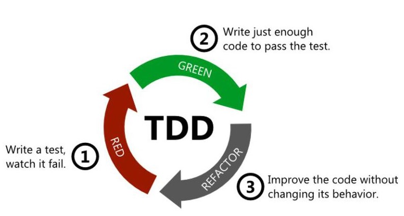

의식적으로 TDD, 리팩토링하기

오키콘 박재성님의 강연을 토대로 공부한 내용 정리글 입니다.

[[OKKYCON: 2018] 박재성 - 의식적인 연습으로 TDD, 리팩토링 연습하기](./https://youtu.be/cVxqrGHxutU)

**1단계 - 단위 테스트 연습**
- 알고리즘을 학습한다면, 알고리즘에 대한 단위 테스트 연습을 한다.
- 내가 사용하는 API의 사용법을 익히기 위한 학습 테스트에서 시작  
```java
public class StringTest {
	@Test
	public void split() {
		String[] valuse = "1".split(",");
		assertThat(valuse).contains("1");
		
		valuse = "1,2".split(",");
		assertThat(valuse).containsExactly("1", "2");
	}
	
	@Test
	public void subString() {
		 - - -
	}
}
```

**2단계 - TDD연습**
- 회사 프로젝트에 적용하지 않는다.
- 웹, 모바일 UI나 DB에 의존관계를 갖지 않는 코드로 연습한다.

- 문자열 덧셈 계산기 요구사항  

쉽표(,) 또는 콜론(:)을 구분자로 갖는 문자열을 전달하는 경우 구분자를 기준으로 분리한 각 숫자의 합을 반환

입력(input)|출력(output)
----|----| 
null또는 "" |0|
"1" |1|
"1,2" |3|
"1,2:3" |6|



1. 테스트코드 만들기
```java
public class StringCalculatorTest {
	@Test
	public void null_또는_빈값(){
		assertThat(StringCalculator.splitAndSum(null)).isEqualTo(0);
		assertThat(StringCalculator.splitAndSum("")).isEqualTo(0);
	}
	
	@Test
	public void 값_하나(){
		assertThat(StringCalculator.splitAndSum("1")).isEqualTo(1);
	}
	
	@Test
	public void 쉼표_구분자(){
		assertThat(StringCalculator.splitAndSum("1,2")).isEqualTo(3);
	}
	
	@Test
	public void 쉼표_콜론_구분자(){
		assertThat(StringCalculator.splitAndSum("1,2:3")).isEqualTo(6);
	}
}
```

2. 프로덕션 코드 만들기
```java
public class StringCalculator {
	public static int splitAndSum(String text) {
		int result = 0;
		
		if(text == null || text.isEmpty()) {
			result = 0;
		} else {
			String[] valuse = text.split(",|:");
			
			for(String value : valuse) {
				result += Integer.parseInt(value);
			}
		}
		
		return result;
	}
}
```

**3단계 - 리팩토링 연습 (메소드분리)**  
input output 의 변경은 없고 내부 코드를 더 예쁘게.. 테스트 코드말고, 테스트 대상 코드를 리팩토링 하나.  

- 한 메서드에 오직 한 단계의 들여쓰기만 한다.
```java
public class StringCalculator {
	public static int splitAndSum(String text) {
		int result = 0;
		
		if(text == null || text.isEmpty()) {
			result = 0;
		} else {
			String[] valuse = text.split(",|:");
			
			result = sum(valuse);
		}
		
		return result;
	}
	
	private static int sum(String[] valuse) {
		int result = 0;
		
		for(String value : valuse) {
			result += Integer.parseInt(value);
		}
		
		return result;
	}
}
```

- else를 쓰지 않는다.
```java
public class StringCalculator {
	public static int splitAndSum(String text) {
		if(text == null || text.isEmpty()) {
			return 0;
		} 
		
		String[] valuse = text.split(",|:");
		return sum(valuse);
	}
	
	private static int sum(String[] valuse) {
		int result = 0;
		for(String value : valuse) {
			result += Integer.parseInt(value);
		}
		return result;
	}
}
```


- 메소드가 한 가지 일만 하도록 구현하기
```java
public class StringCalculator {
	public static int splitAndSum(String text) {
		if(text == null || text.isEmpty()) {
			return 0;
		} 
		
		String[] valuse = text.split(",|:");
		int[] numbers = toInts(valuse);
		return sum(numbers);
	}
	
	private static int sum(int[] numbers) {
		int result = 0;
		for(int number : numbers) {
			result += number;
		}
		return result;
	}
	
	private static int[] toInts(String[] valuse) {
		int[] numbers = new int[valuse.length];
		for(int i = 0; i < valuse.length; i++) {
			numbers[i] = Integer.parseInt(valuse[i]);
		}
		return numbers;
	}
}
```


- 로컬 변수가 정말 필요한가?
```java
public class StringCalculator {
	public static int splitAndSum(String text) {
		if(text == null || text.isEmpty()) {
			return 0;
		} 
				
		return sum(toInts(text.split(",|:")));
	}
	
	private static int sum(int[] numbers) {
		int result = 0;
		for(int number : numbers) {
			result += number;
		}
		return result;
	}
	
	private static int[] toInts(String[] valuse) {
		int[] numbers = new int[valuse.length];
		for(int i = 0; i < valuse.length; i++) {
			numbers[i] = Integer.parseInt(valuse[i]);
		}
		return numbers;
	}
}
```

- compose method 패턴 적용

함수의 의도가 잘 드러나도록 동등한 수준의 작업을 하는 여러 단계로 나눈다.
```java
public class StringCalculator {
	public static int splitAndSum(String text) {
		if(isBlank()) {
			return 0;
		} 
		return sum(toInts(split(text)));
	}
	
	private static boolean isBlank(String text) {
		return text == null || text.isEmpty();
	}
	
	private static String[] split(String text) {
		return text.split(",|:");
	}
	
	private static int sum(int[] numbers) {
		int result = 0;
		for(int number : numbers) {
			result += number;
		}
		return result;
	}
	
	private static int[] toInts(String[] valuse) {
		int[] numbers = new int[valuse.length];
		for(int i = 0; i < valuse.length; i++) {
			numbers[i] = Integer.parseInt(valuse[i]);
		}
		return numbers;
	}
}
```

**3단계 - 리팩토링 연습 (클래스 분리)**  
- 문자열 덧셈 계산기 재요구사항  

쉽표(,) 또는 콜론(:)을 구분자로 갖는 문자열을 전달하는 경우 구분자를 기준으로 분리한 각 숫자의 합을 반환.  
문자열 계산기에 숫자 이외의 값 또는 음수를 전달하는 경우 RuntimeException 예외를 throw한다.

입력(input)|출력(output)
----|----| 
null또는 "" |0|
"1" |1|
"1,2" |3|
"1,2:3" |6|
"-1,2:3" |RuntimeException|

```java
public class StringCalculator {
	public static int splitAndSum(String text) {
		if(isBlank()) {
			return 0;
		} 
		return sum(toInts(split(text)));
	}
	
	private static boolean isBlank(String text) {
		return text == null || text.isEmpty();
	}
	
	private static String[] split(String text) {
		return text.split(",|:");
	}
	
	private static int sum(int[] numbers) {
		int result = 0;
		for(int number : numbers) {
			result += number;
		}
		return result;
	}
	
	private static int[] toInts(String[] valuse) {
		int[] numbers = new int[valuse.length];
		for(int i = 0; i < valuse.length; i++) {
			numbers[i] = toInt(valuse[i]);
		}
		return numbers;
	}
	
	private static int[] toInt(String value) {
		int number = Integer.parseInt(value);
		
		if(number < 0) {
			throw new RuntimeException();
		}
		
		return number;
	}
}
```

- 모든 원시값과 문자열은 포장하라.

```java
public class Positive {
	private int number;
	
	public Positive(String value) {
		this(Integer.parseInt(value);
	}
	
	public Positive(int number) {
		if(number < 0) {
			throw new RuntimeException();
		}
		
		this.number = number;
	}
	
	pubilc Positive add(Positive other){
		return new Positive(this.number + other.getNumber());
	}
	
	public int getNumber() {
		return this.number;
	}
}
```

```java
public class StringCalculator {
	public static int splitAndSum(String text) {
		if(isBlank()) {
			return 0;
		} 
		return sum(toInts(split(text)));
	}
	
	private static boolean isBlank(String text) {
		return text == null || text.isEmpty();
	}
	
	private static String[] split(String text) {
		return text.split(",|:");
	}
	
	private static int sum(int[] numbers) {
		Positive result = new Positive(0);
		for(Positive number : numbers) {
			result.add(number);
		}
		return result.getNumber();
	}
	
	private static Positive[] toInts(String[] valuse) {
		Positive[] numbers = new int[valuse.length];
		for(int i = 0; i < valuse.length; i++) {
			numbers[i] = new Positive(valuse[i]);
		}
		return numbers;
	}
}
```

- 일급 콜렉션을 쓴다.
```java
public class Lotto {
	private static final int LOTTO_SIZE = 0;
	
	private final Set<LottoNumber> lotto;
	
	private Lotto(Set<LottoNumber> lotto) {
		if(lotto.size() != LOTTO_SIZE ) {
			throw new IllegalArgumentException();
		}
		
		this.lotto = lotto;
	}
}
```


- 세개 이상의 인스턴스를 가진 클래스를 쓰지 않는다.
```java
public class WinningLotto {
	private final Lotto lotto;
	private final LottoNumber no;
	
	public WinningLotto(Lotto lotto, LottoNumber no) {
		if(lotto.contains(no) {
			throw new IllegalArgumentException();
		}
		
		this.lotto = lotto;
		this.no = no;
	}
	
	public Rank match(Lotto userLotto) {
		int matchCount = lotto.match(userLotto);
		boolean matchBonus userLotto.contains(no);
		return Rank.valueOf(matchCount, matchBonus);
	}
}
```

**4단계 - 장난감 프로젝트 난이도 높이기**  

연습방법
- 게임과 같은 요구사항이 명확한 프로그램으로 연습
- 의존관계(모바일 UI, 웹 UI, 데이터베이스, 외부API) 가 없이 연습
- 약간 복잡한 로직이 있는 프로그램
- 프레임워크 이용이 아니라, 순수 언어의 기능으로 구현 가능한 것들

연습하기 좋은 예 (콘솔 UI)
- 로또
- 사다리 타기
- 볼링 게임
- 체스 게임 
- 지뢰찾기 게임 

**5단계 - 의존관계를 추가하여 난이도 높이기**  
- 의존관계(모바일 UI, 웹 UI, 데이터베이스, 외부API) 추가
- 레거시 애플리케이션에 테스트 코드를 넣어서 리팩토링하기

**기타 코드 작성 규칙**

객체지향 생활체조 원칙  
규칙 1: 한 메서드에 오직 한 단계의 들여쓰기만 한다.  
규칙 2: else 예약어를 쓰지 않는다.  
규칙 3: 모든 원시값과 문자열을 포장한다.  
규칙 4: 한 줄에 점을 하나만 찍는다.  
규칙 5: 줄여쓰지 않는다(축약 금지).  
규칙 6: 모든 엔티티를 작게 유지한다.  
규칙 7: 2개 이상의 인스턴스 변수를 가진 클래스를 쓰지 않는다.  
규칙 8: 일급 콜렉션을 쓴다.  
규칙 9: 게터/세터/프로퍼티를 쓰지 않는다.  

메소드 인수 개수  
메소드에서 이상적인 인자 개수는 0개, 다음은 1개, 다음은 2개, 3개는 가능한 피하는게 좋다. 4개 이상은 사용하지 말자.

클래스  
클래스를 만들 떄 첫 번째 큐직은 크기다.  
클래스는 작아야한다.  
두 번째 규칙도 크기다.  
더 작아야 한다.